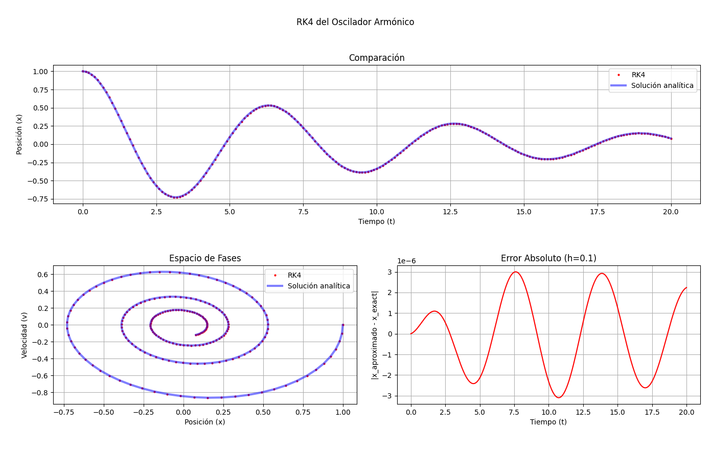
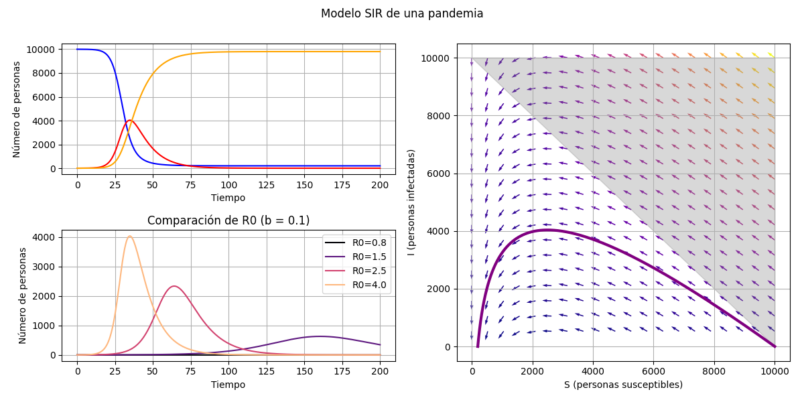

# metodos-numericos

Implementar métodos que aproximan las soluciones a diversos problemas en Python. 

## RK4

Definiendo la función RK4 se resuelve:

- El oscilador armónico amortiguado, partiendo de su ecuación. 

- Un modelo de pandemia SIR con el número de Susceptibles, Infectados y Recuperados. También se comparan distintos R0, parámetro importante para predecir el contagio de un virus.

## Descenso de gradiente

Aplicar el descenso de gradiente de machine learning para encontrar parámetros de un ajuste lineal y = a*x+b.



... 🚧 under construction ...