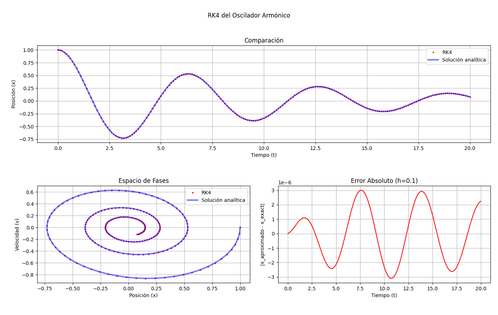
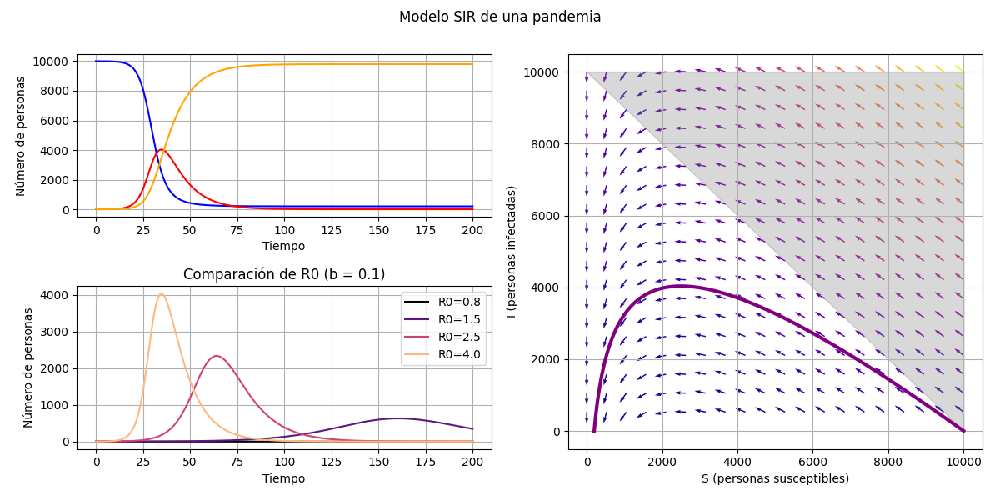
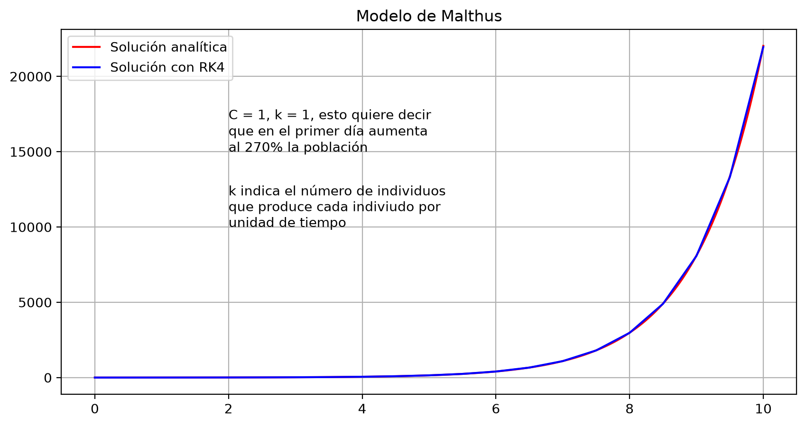
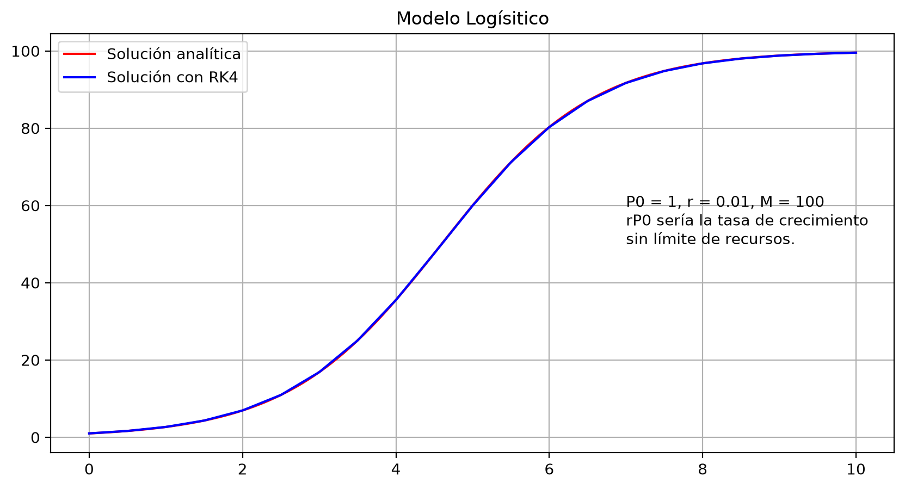
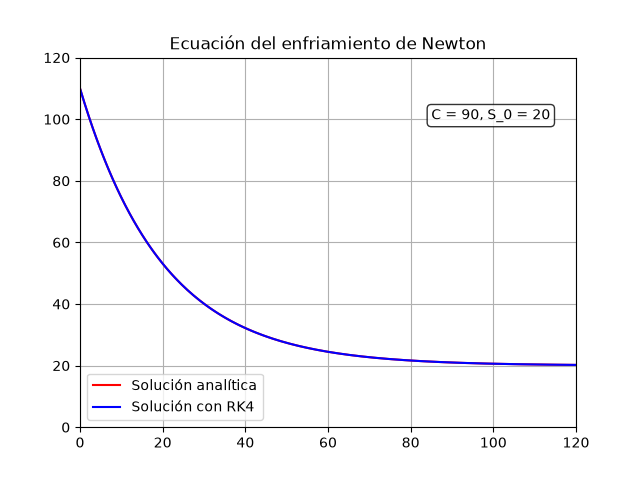
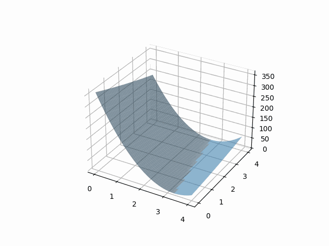

# metodos-numericos

Implementar métodos que aproximan las soluciones a diversos problemas en Python. He ido añadiendo varios modelos que he visto en la asignatura de Ecuaciones Diferenciales.

## RK4

Definiendo la función RK4 se resuelve:

- El oscilador armónico amortiguado, partiendo de su ecuación. 

- Un modelo de pandemia SIR con el número de Susceptibles, Infectados y Recuperados. También se comparan distintos R0, parámetro importante para predecir el contagio de un virus.

- La ecuación del modelo de malthus es: dP/dt = kP. El crecimiento de la población es proporcional a k, la diferencia entre la tasa de nacimientos y la de muertes. Si k es positivo entonces la población explota. Este modelo de población no tiene en cuenta recursos, por eso no es realista. La solución es una ecuación exponencial P(t) = C_0 * e^(kt).

- La ecuación logística modela una población pero con un límite de recursos. dP/dt = r(M-P)P. En el modelo se ve que la población tiende a establiziarse en el M cuando t tiende a infinito. La solución analítica es: P(t) = P0*M0 / P0+(M-P0)*e^-rMt. [más sobre esta función](https://youtu.be/aP4YXOo-Uko?si=AbKSS1LU2g7r6ETC)

- La ecuación diferencial dT/dt = -k(T-S) es un decaimiento exponencial. Tiene como solución analítica: T(t) = S_0 + C*e^(-kt). 
Podría modelar la temperatura de un cazo con agua muy caliente en una habitación a temperatura ambiente. 

## Descenso de gradiente

Aplicar el descenso de gradiente de machine learning para encontrar parámetros de un ajuste lineal y = a*x+b.

